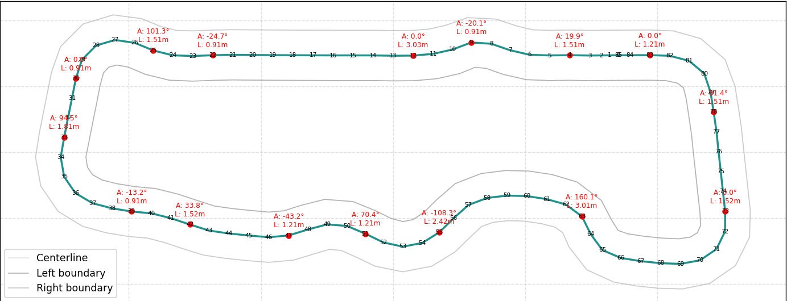
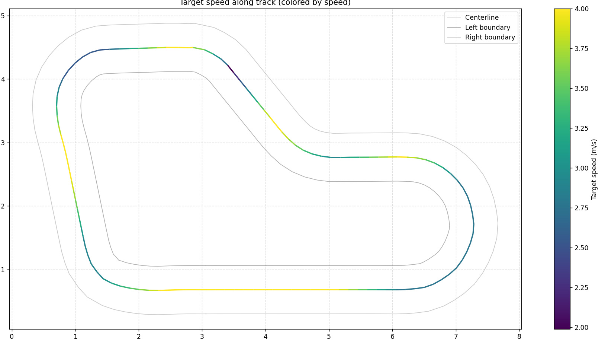
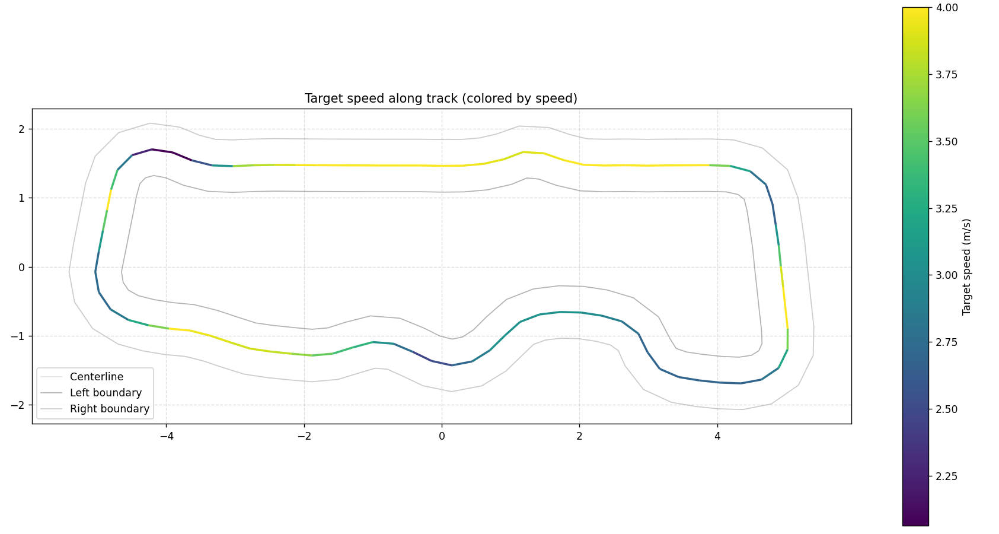

🏎️ MOD DeepRacer Event – CacheMeIfYouCan

DeepRacer project developed for the MOD DeepRacer STEM 2025 Event held in Corsham.
Created by Team CacheMeIfYouCan, representing our university at the event.

Our focus was on optimizing both individual and team-trained models to achieve balanced speed, control, and lap consistency on the virtual track.

📸 Track Visualizations

Track analysis and speed profiling:

Track Layout	Speed Heatmap 1	Speed Heatmap 2

| Waypoints on Track | Speed Heatmap 1 | Speed Heatmap 2 |
|:------:|:-----------:|:-----------:|
|  |  |  |

	
🧠 Models Overview

Personal Model:
Trained for 10 hours with a focus on centerline alignment, smooth steering, and efficient lap completion.
The reward function prioritized stability and precision for consistent performance.

Team Models:
Collaboratively trained for 25 hours, exploring 15+ variations of reward functions and hyperparameters.
Our aim was to push for faster lap times while maintaining robustness across corners and straights.

🏆 Event Results & Achievements

🥇 1st Place on the MOD Corsham STEM 2025 Virtual Track

🏫 University teams secured overall placements of 1st, 5th, and 7th

💻 Our team (CacheMeIfYouCan) finished 7th overall in the MOD DeepRacer STEM 2025 Competition

⚙️ Over 15 model iterations tested and refined through experimentation and analysis

⚙️ Usage
1. Clone the Repository
git clone https://github.com/Nickg05/MOD_DeepRacer_Event.git
cd MOD_DeepRacer_Event

2. Modify or Experiment with Reward Function

Edit the main reward script (for example reward_function.py) to adjust parameters for your own training session.

3. Deploy on AWS DeepRacer Console

Upload the reward function script under Model → Create Model → Reward Function

Choose your preferred action space and hyperparameters

Train using your selected track and time budget

4. Evaluate Results

Use AWS logs and visualization tools to analyze speed, progress, and off-track performance.
Track visualizations like the ones above can be generated using DeepRacer’s notebook utilities.

👥 Team

Team: CacheMeIfYouCan
Event: MOD DeepRacer STEM 2025, Corsham
Focus Areas: Reward function design, track analysis, and performance optimization.